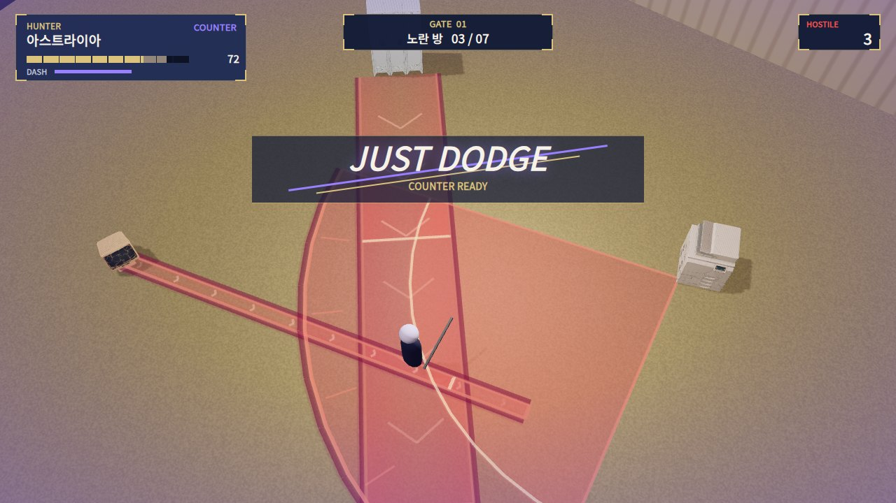
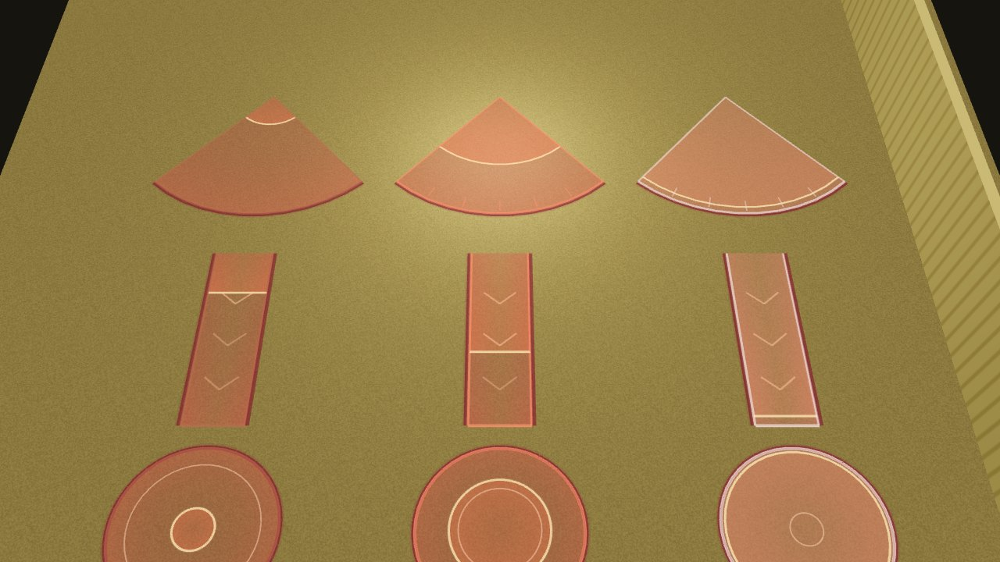

# 손맛: 히트 스톱 · 저스트 회피 · 반격 · 텔레그래프

저스트 회피 순간의 목업이다. 복사기 부채꼴, 로커 돌진선, 모니터 조준선이 동시에 깔려 있다. 텔레그래프는 `Telegraph.cs`의 메시 생성 코드를 three.js로 옮겨 렌더했고, HUD는 `LiminalHud`의 좌표·색·글꼴 크기를 그대로 옮긴 HTML이다. 플레이어는 대역 실루엣이다.

## 히트 스톱 (`HitFeedback.HitStop`)

| 상황 | 멈춤 | 흔들림 | 그 밖의 연출 |
| --- | --- | --- | --- |
| 일반 베기 적중 | 0.035–0.07초, 속도 ×0.08 | 0.03–0.09 | 적 몸체 떨림(`ImpactJitter`, 실제 시간), 타격음 |
| 무거운 베기 (마무리·반격) | 위의 1.6배, 속도 ×0.04 | 1.8배 | 십자 베기, 꽃잎, 분홍 화면 섬광, 강타음 |
| 플레이어 피격 | 0.075초, 속도 ×0.07 | 0.1 / 0.2초 | 붉은 화면 섬광 0.28초, 모델 깜빡임, 피격음 |

- 멈춤은 마지막 35% 동안 부드럽게 풀린다. 툭 끊기지 않는다.
- 대시를 누르면 진행 중인 히트 스톱을 바로 끝낸다(`CancelHitStop`). 회피가 타격 정지에 묶이지 않는다.
- 효과음은 모두 코드로 합성한다(`HitFeedback.Sfx`). 오디오 파일이 없다.
  - `Swing`: 바람 가르는 소리
  - `Hit`: 베는 소리
  - `HeavyHit`: 저음이 섞인 강타
  - `JustDodge`: 위로 올라가는 반짝임
  - `Hurt`: 피격음
  - `Thud`: 둔탁한 소리

## 저스트 회피 (`LiminalPlayerHealth`, `JustDodgeFeedback`)

**판정**
- 대시 무적 중(대시 시간 + 0.1초 유예) 막힌 공격이 있으면 저스트 회피다.
- 대시 한 번에 한 번만 판정한다.
- 피해를 주는 모든 공격이 대상이라 몬스터마다 따로 코드를 넣지 않았다. 종이, 2진수 탄, 자판기 캔, 신호등 차, 로커 돌진이 모두 포함된다.
- 로커의 촉수 잡기는 피해 없이 붙잡는 공격이라 따로 알린다(`NotifyDodged`).

**연출과 보상**

| 항목 | 값 |
| --- | --- |
| 슬로 모션 | 실제 시간 0.5초 동안 속도 ×0.22. 끝날 때 서서히 풀린다. 이 동안에는 히트 스톱을 무시하고, 새 대시도 슬로 모션을 끊지 않는다. |
| 화면 | 보라 섬광 0.35초, 약한 흔들림, 먼지, 불꽃, 보라 잔상 |
| HUD | 화면 위쪽에 `JUST DODGE` 도장이 찍힌다. 크게 들어와 자리 잡고 0.9초 뒤 사라진다. 밝은 바닥에서도 읽히도록 반투명 네이비 띠를 깐다. 상태창에는 `COUNTER` 표시가 뜬다. |
| 대시 | 재사용 대기 시간이 바로 초기화된다. |
| 반격 창 | 1.3초 |

## 반격 (`MeleeSlash.GrantCounter`)

반격 창 동안의 모든 베기는 무거운 베기가 된다. 피해는 1.6배(`counterMultiplier`)이고, 위 표의 강타 연출이 붙는다. 반격 창은 실제 시간으로 잰다. 슬로 모션 중에도 줄어들지 않고 그대로 남는다.

로비 강화 `반격 각성`은 레벨마다 반격 창을 0.25초, 배율을 0.1 늘린다([HunterLobby](../HunterLobby/README.md)).

## 텔레그래프 (`Telegraph`, `TelegraphOverlay`)

왼쪽부터 진행도 25% · 60% · 95%이다. 위에서부터 부채꼴, 직선, 원이다.

윤곽선만 있던 예고선을 바닥 데칼처럼 바꿨다.

| 층 | 내용 |
| --- | --- |
| 바탕 | 반투명 진홍색. 가장자리로 갈수록 진해진다. |
| 충전 | 공격이 준비되는 동안 시작점에서 끝까지 더 붉은 면이 차오른다. 언제 공격이 나올지 한눈에 읽힌다. |
| 진행 전선 | 차오르는 경계에 밝은 금빛 선이 있다. |
| 테두리 | 채도 높은 주황빛 빨강 테두리에 어두운 바깥 선을 둘렀다. 밝은 리미널 바닥(카펫, 타일)에서 가산 발광은 크림색으로 날아가므로, 두 층 모두 알파 블렌드로 그린다. |
| 장식 | 부채꼴은 눈금, 직선은 진행 방향으로 흐르는 갈매기표, 원은 중심으로 좁혀 드는 안쪽 고리 |
| 직전·발사 | 88%부터 하얗게 깜빡인다. 발사 순간 0.16초 동안 흰 잔광이 남고 사라진다. |

**적용 대상**
- 복사기: 부채꼴, 종이 저격선
- 로커: 잡기선, 회전 돌진선
- 모니터: 조준선
- 자판기·신호등 보스: 기존 `LineRenderer` 예고선의 로직과 테스트(`warning.enabled`)는 그대로 둔다. `TelegraphOverlay`가 그 점을 읽어 새 데칼로 그린다(점 5개는 직선, 16개 이상은 원).

## 플레이 중 문장 제거

토스트, 목표 문구, 조작 안내, 스킬 설명 같은 플레이 중 문장을 모두 없앴다(`LiminalHud.Notify`는 아무것도 하지 않는다). 화면에 남는 것은 다음뿐이다.

- 헌터 상태창: 체력, 대시 충전, 반격
- 게이트·구역 표시
- 남은 적 수
- 보스 체력
- 저스트 회피 도장
- 상호작용 키
- 메뉴 창: 증강, 일시 정지, 결과

## Unity에서 확인할 것

- URP `Particles/Unlit` 셰이더에서 정점 색 알파가 그대로 나오는지 확인한다(텔레그래프 두 층).
- 슬로 모션 중 `Animator`와 파티클이 함께 느려지는지 확인한다(`Time.timeScale` 기준).
