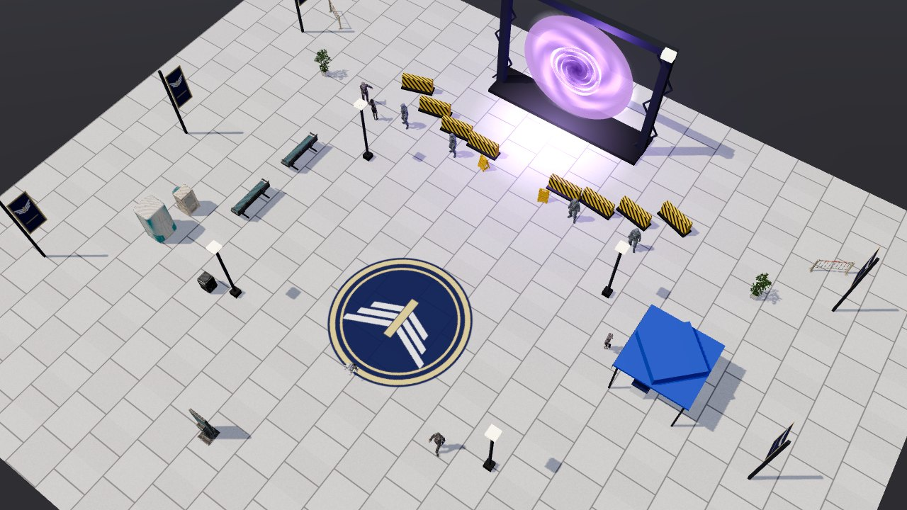
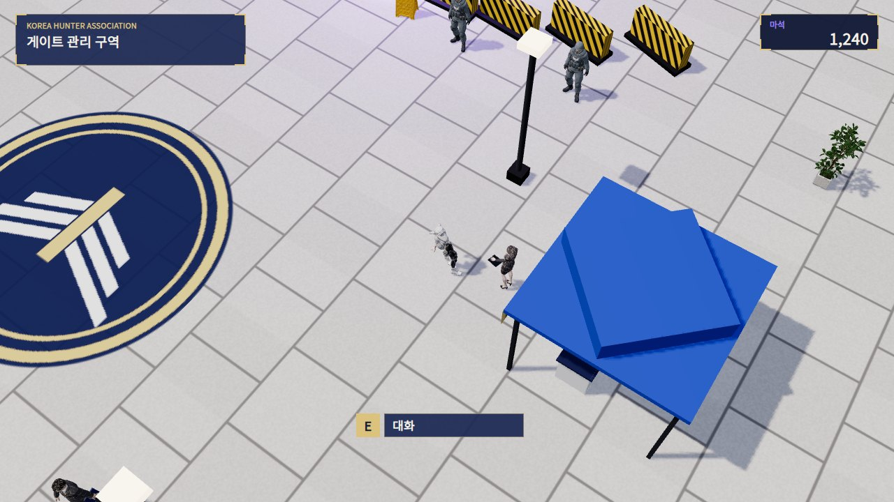
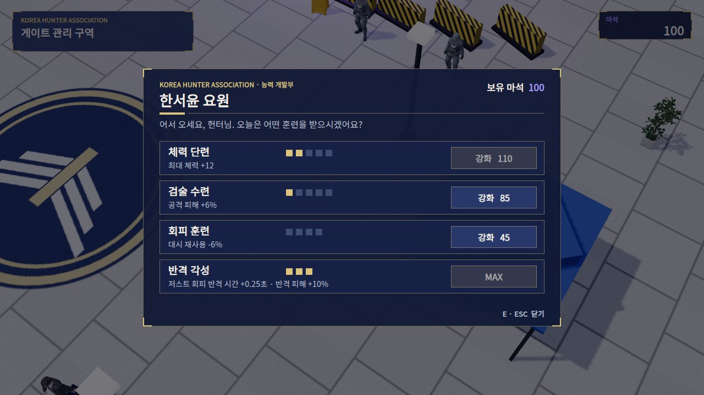
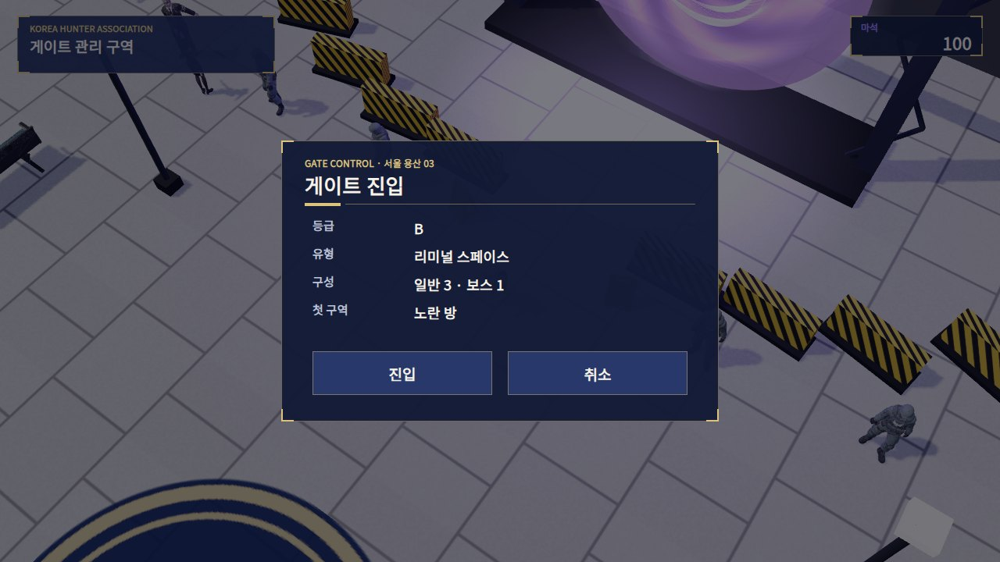
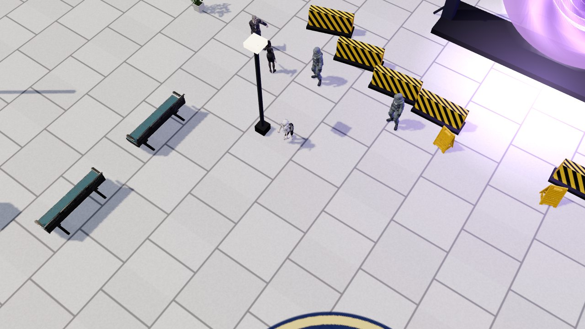
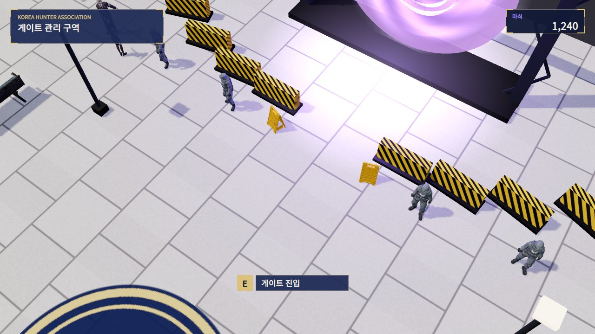
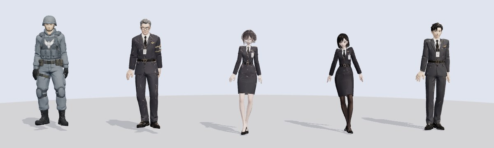
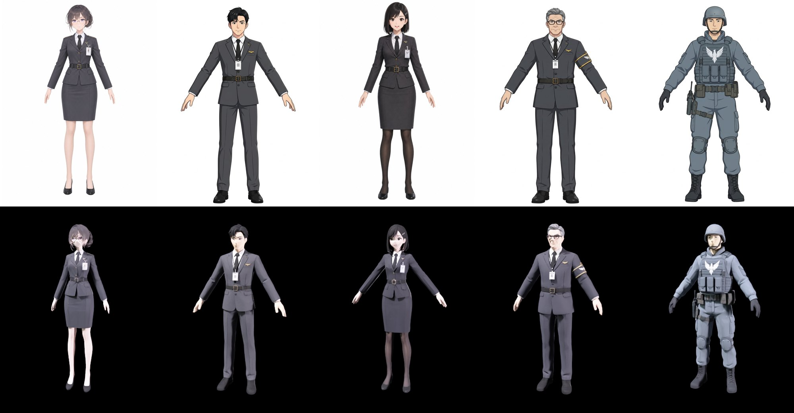
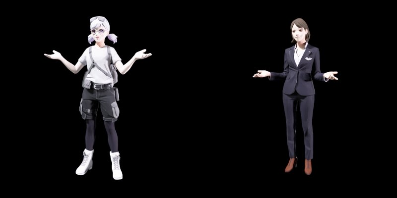

# 헌터 협회 게이트 관리 구역 (액티브 로비)

버튼 목록으로 된 로비가 아니다. 플레이어가 평상복 차림으로 광장을 걸어 다니며 협회 요원에게 말을 걸어 강화하고, 게이트 앞에서 상호작용해 던전에 들어간다. 컨셉 기획서(현대 판타지 헌터물, 서울에 열린 게이트, 일상복과 던전복의 갭)에 맞췄다.

광장에 있는 사람은 모두 컨셉 아트의 협회 직원을 Meshy로 옮긴 캐릭터다([협회 직원](#협회-직원-meshy)). 요원, 직원 셋, 경비 넷이 있다.

| 걸어 다니기 · 상호작용 키 | 요원 대화 · 강화 | 게이트 진입 확인 |
| --- | --- | --- |
|  |  |  |

| 휴게 구역의 국장과 신입 | 통제선의 경비 |
| --- | --- |
|  |  |

미리보기는 `LiminalLobby.Construct`의 배치를 three.js로 재현하고, HUD와 창을 `HunterUi`의 좌표·색·글꼴 크기로 그린 것이다. 직원과 경비는 게임과 같은 Meshy 클립의 한 순간을 재생한 자세다. 플레이어는 대기 자세의 대역이다.

## 흐름

1. 게임을 시작하면 로비에서 시작한다(`LiminalRunDirector.startInLobby`, 기본값 켜짐).
2. 로비에서는 이동만 된다. 공격과 부적은 꺼진다.
3. 상호작용할 대상에 다가가면 가장 가까운 대상의 키가 화면 아래에 뜬다.
   - 키보드: `E`로 상호작용, `ESC`로 닫기
   - 패드: 아래 버튼으로 상호작용, 오른쪽 버튼으로 닫기
4. **요원 한서윤**(능력 개발부)에게 말을 걸면 강화 창이 열린다.
   - 요원은 플레이어 쪽으로 몸을 돌린다. 이번 방문에서 처음 다가가면 정중하게 인사한다(인사 중에 말을 걸면 인사를 끊고 바로 대화한다). 대화 중에는 손짓하며 말한다.
   - 요원은 컨셉 아트처럼 클립보드를 들고 있다.
5. **게이트**에 상호작용하면 진입 확인 창이 열린다. 창에는 등급, 유형, 구성, 첫 구역이 나온다.
6. `진입`을 누르면 다음 순서로 던전에 들어간다.
   1. 화면이 보라색으로 덮인다.
   2. 그 뒤에서 전투복으로 갈아입고 영구 강화가 적용된다.
   3. 런이 시작되고 보라색이 걷힌다.
7. 런이 끝나면(게이트 클리어 또는 헌터 후송) 결과 창이 뜬다. 버튼은 두 개다.
   - `로비로 귀환`
   - `바로 재도전`: 로비를 거쳐 곧바로 다음 게이트로 들어간다.
   - 일시 정지 창에서도 로비로 귀환할 수 있다.
8. 로비로 돌아오면 다음 순서로 정리된다.
   1. 이번 런에서 모은 마석을 받는다.
   2. 경로를 정리하고 체력을 회복한다.
   3. 평상복으로 돌아온다.
9. 매 런은 다른 시드로 생성된다.

## 마석과 영구 강화 (`HunterProgress`)

마석은 런 중에 모이고 로비로 돌아올 때 지급된다. 헌터 후송(사망)이어도 모은 만큼 받는다.

| 획득 | 마석 |
| --- | --- |
| 전투 구역 정리 | 15 |
| 그 밖의 구역 정리 | 5 |
| 다음 게이트로 이동 | 40 |
| 보스 구역 정리 | 150 |

| 강화 | 레벨당 효과 | 최대 | 비용 |
| --- | --- | --- | --- |
| 체력 단련 | 최대 체력 +12 | 5 | 40 · 70 · 110 · 160 · 220 |
| 검술 수련 | 공격 피해 +6% | 5 | 50 · 85 · 130 · 185 · 250 |
| 회피 훈련 | 대시 재사용 대기 −6% | 4 | 45 · 90 · 150 · 220 |
| 반격 각성 | 저스트 회피 반격 창 +0.25초, 반격 피해 +10% | 3 | 80 · 150 · 240 |

- 마석과 강화 레벨은 `PlayerPrefs`에 저장된다(`Hunter.MagicStones`, `Hunter.Upgrade.<이름>`).
- 강화는 던전에 들어갈 때 `HunterProgress.Apply`로 플레이어에 적용된다.
- 강화 창의 레벨 칸, 비용, 구매 가능 여부는 구매할 때마다 새로 그려진다. 살 수 없는 줄은 버튼이 회색이다.
- 구매하면 금빛 섬광과 효과음이 난다.

## 광장 구성 (`LiminalLobby`, 런타임 생성)

로비는 경로와 떨어진 곳(감독 기준 z −420)에 코드로 짓는다. 새 씬이나 애니메이터 에셋은 없다.

| 요소 | 내용 |
| --- | --- |
| 바닥 | 석재 포장(절차 텍스처), 바깥 아스팔트, 44×36m 보이지 않는 경계벽 |
| 게이트 | 트러스 기둥 두 개, 조명, 받침대. 보라 균열 원판과 소용돌이 원판 네 겹이 돈다. 바닥 발광과 보라 점광원이 있다. |
| 통제선 | 노랑·검정 바리케이드 호. 협회 경비 4명이 광장 쪽을 보고 서서 가끔 주변을 살핀다. |
| 협회 부스 | 파란 천막, 협회 날개 엠블럼 휘장, 접수 책상. 요원은 부스 앞에 선다. |
| 휴게 구역 | 국장이 신입 직원에게 지시하는 중이다. 둘이 마주 보고 번갈아 말한다. |
| 순찰 | 직원 한 명이 부스와 입구 사이를 돈다. 멈출 때마다 기다리거나 통화하고, 플레이어가 앞을 막으면 멈춰서 쳐다본다. |
| 바닥 엠블럼 | 광장 중앙의 7m 협회 엠블럼(네이비 원, 금빛 고리, 날개) |
| 장식 | 컨셉 맵 소품(대기 의자, 자판기, 정수기, 화분, 휴지통, 주의 표지판, 안내 키오스크, 접이식 차단봉), 가로등 4개, 협회 배너 6개 |
| 원경 | 창문이 빛나는 빌딩 스카이라인, 남산과 N서울타워 |

소품 프리팹은 `LiminalMonsterLibrary`의 로비 장식 칸에서 가져온다.

## 협회 직원 (Meshy)

컨셉 아트 오른쪽의 협회 직원(안경, 낮게 묶은 머리, 벨트를 맨 차콜 정장, 넥타이, ID 카드)을 기준으로 만들었다. 손으로 도형을 쌓아 만든 사람은 없다.

| 캐릭터 | 모습 | 동작 (라이브러리 id) | 로비에서 하는 일 |
| --- | --- | --- | --- |
| `association_agent` 한서윤 요원 | 컨셉 아트의 그 직원. 안경, 묶은 머리, 스커트 정장 | 대기 Idle_3(243), 대화 313, 인사 Formal Bow(41) | 부스 앞. 강화 창 담당. 왼손에 협회 엠블럼 클립보드 |
| `association_clerk` 직원 | 20대 남성, 같은 제복 바지 정장 | 대기 Idle_9(249), 걷기 Casual Walk(30), 통화 Phone Conversation(312) | 순찰. 왼손에 서류철 |
| `association_officer` 신입 직원 | 20대 여성, 단발, 머리핀, 검은 스타킹 | 대기 Idle_7(247), 대화 Stand and Chat(56), 걷기(1) | 휴게 구역에서 국장과 대화 |
| `association_director` 국장 | 40대 남성, 희끗한 머리, 사각 안경, 금테 엠블럼 완장 | 대기 Idle_11(251), 지시 Talk with Right Hand Open(314) | 휴게 구역에서 신입에게 지시 |
| `association_guard` 경비 | 회색 전술복, 헬멧, 날개 엠블럼 방탄조끼, 무기 없음 | 대기 Idle_11(251), 살피기 Short Breathe and Look Around(338) | 통제선 4곳 |

라이브러리 0번 `Idle`은 다리를 벌리고 몸을 돌리는 준비 자세라 쓰지 않았다. 차분한 대기 동작으로 바꿨다.

위는 고른 컨셉 시트, 아래는 Meshy 3D 결과다.

**만드는 과정** (`Tools/LiminalLobby/meshy_lobby.py`, `OFFICIALS`)

1. 참고 이미지에서 직원과 경비를 잘라 둔다(`Tools/LiminalLobby/Reference/official.png`, `guards.png`).
2. image-to-image로 전신 A 포즈 캐릭터 시트를 그린다.
   - 빈손, 흰 배경, 같은 제복 설계로 그린다.
   - 캐릭터마다 두 모델(`nano-banana-pro`, `gpt-image-2`)로 후보를 하나씩 만든다.
3. 후보 중 하나를 고른다(`pick`).
   - 요원은 컨셉 아트를 가장 닮은 쪽을 골랐다.
   - 나머지는 팔이 몸에서 잘 떨어진 A 포즈 쪽을 골랐다(리깅 품질).
4. image-to-3d(`meshy-7.1`, `pose_mode: a-pose`, 2만 삼각형)로 3D를 만든다.
5. 리깅한다.
6. 라이브러리 동작을 입힌다.
   - 동작 FBX는 `extract_armature`로 뼈대만 받는다(약 220KB).
   - 메시는 `<이름>.fbx` 한 곳에만 있다. Unity에서 Humanoid로 리타깃해 재생한다.

**동작 (`LobbyNpc`, `LobbyRoutine`)**

- Playables 믹서로 반복 동작을 0.3초에 걸쳐 섞는다. 인사 같은 한 번짜리 동작은 끝나면 원래 반복 동작으로 돌아간다.
- 같은 경비 네 명이 똑같이 움직이지 않도록 시작 시점을 무작위로 어긋나게 한다.
- `Station`: 자리를 지키며 가끔 활동 동작을 한다.
- `Chat`: 상대를 보고 말하기와 듣기를 번갈아 한다.
- `Patrol`: 지점을 돌며 걷는다. 지점마다 2.5–5.5초 멈춘다. 몸이 진행 방향을 향한 뒤에 걷는다.
- 누구든 플레이어가 2.3m 안에 오면 플레이어를 쳐다본다.
- 클립보드(`HeldBoard`)는 매 프레임 손 뼈를 따라간다.
  - 리그의 뼈 축과 상관없도록 월드 기준으로 계산한다.
  - 위쪽 가장자리를 쥔 채 손 아래로 늘어지고, 앞면은 몸 바깥을 본다.

- 재생성: `python Tools/LiminalLobby/meshy_lobby.py concept|pick|run --character <이름>`
- 직원 다섯 명에 Meshy 크레딧 334를 썼다.
  - 컨셉 후보 10장: 105
  - 3D: 150
  - 리깅: 25
  - 동작: 39
  - 대기 동작 교체: 15

## 플레이어 평상복 (Meshy)

| 캐릭터 | 결과 | 사용 |
| --- | --- | --- |
| `player_casual` | 연보라 트윈테일, 흰 티셔츠, 카고 반바지, 운동화 | 로비에서 플레이어 모델을 이것으로 바꾼다. 플레이어의 Humanoid 이동 컨트롤러를 그대로 공유하고, 전투 모델 키에 맞춘다. 카타나는 숨긴다. |
| `association_staff` (예전 요원) | 네이비 정장 | 지금은 쓰지 않는다. 컨셉 아트 기반의 `association_agent`로 바꿨다. 파일은 남겨 두었다. |

- 생성 과정: text-to-3d v2(A 포즈, preview → refine) → rigging v1 → animations v1. 모델은 `meshy-7.1`이다.
- 사용한 크레딧은 76이다.
- 파일 위치는 `Assets/Liminal/Resources/LiminalLobby/`이다.
  - FBX는 Humanoid로 들여온다.
  - 알베도 텍스처는 따로 둔다.
  - 생성 기록은 `provenance.json`에 있다.
- 재생성: `python Tools/LiminalLobby/meshy_lobby.py run [--character player_casual]`
  - API 키는 환경 변수 `MESHY_API_KEY`에서만 읽는다.
  - 작업 id는 `Tools/LiminalLobby/Source/`(git 제외)에 남는다. 다시 실행하면 같은 유료 작업을 이어 쓴다.

## UI (`HunterUi`)

기획서 발표 자료의 톤을 UI 키트로 옮겼다. 런 HUD와 로비 창이 같은 키트를 쓴다.

| 요소 | 스타일 |
| --- | --- |
| 창 | 네이비 본체, 금빛 가는 테두리, 네 모서리 금빛 눈금 |
| 제목 | 크림색 굵은 글씨. 아래에 짧고 굵은 금빛 막대와 긴 가는 선이 붙는다. |
| 강조 | 게이트 관련은 보라, 위험은 빨강 |
| 글꼴 | `NotoSansKR` 동적 SDF |

지원 캐릭터 스킬 HUD도 같은 팔레트로 바꿨다.

## Unity에서 확인할 것

- FBX의 Humanoid 아바타 자동 매핑을 확인한다(Meshy 리그 → Unity Humanoid).
- 평상복 모델이 플레이어 컨트롤러의 이동 애니메이션을 제대로 리타깃하는지, 키 맞춤이 맞는지 확인한다.
- 직원·경비 NPC를 확인한다.
  - 뼈대 전용 동작 FBX가 Humanoid로 들어오는지 확인한다(아바타 자동 생성).
  - 동작을 섞고 인사 뒤 원래 동작으로 돌아오는지 확인한다.
  - 순찰 걸음 속도(1.15m/s)와 발 미끄러짐을 확인한다.
  - 클립보드 위치를 확인한다.
- Meshy 텍스처에는 UV 경계를 따라 옅은 선이 보이는 곳이 있다. 로비 카메라 거리에서는 거의 보이지 않는다.
- 게이트 페이드 타이밍(덮기 0.55초, 0.6초에 런 시작, 1.25초에 걷힘)을 확인한다.
- `LiminalPlayValidation`은 로비에서 시작해 요원과 게이트가 있는지 확인한 뒤 `EnterDungeon`으로 런을 시작한다.
