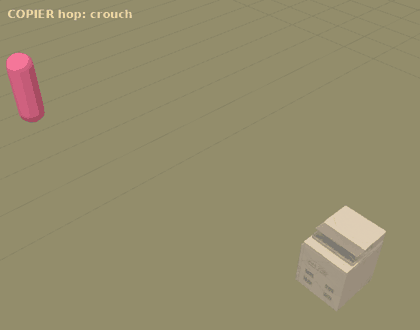
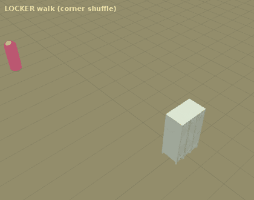
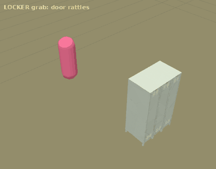
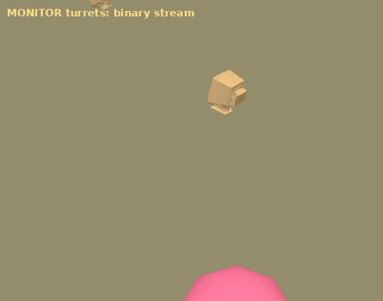

# 사무용품 몬스터: 복사기 · 관물대(로커) · 모니터 포탑

리미널 컨셉 맵에 놓여 있던 사무용품을 몬스터로 만들었다. 대신 기본 도형으로 만든 임시 몬스터 "잔상"과 보스 "관리자"(`LiminalEnemy`)는 삭제했다.

| 복사기 | 로커 회전 돌진 | 로커 잡아 던지기 | 모니터 포탑 |
| --- | --- | --- | --- |
|  |  |  |  |

위 미리보기는 게임 코드와 같은 수식(점프 포즈, 종이 팔랑임, 로커 회전 축, 촉수 경로, 2진수 배치)을 three.js로 재현해 렌더한 것이다. 분홍 캡슐이 플레이어다.

## 등장 방식

전투 방에 들어가면 다음 순서로 몬스터가 깨어난다(`LiminalRunDirector.SpawnOfficeMonsters`).

1. 방에 놓인 복사기·로커 소품은 그 자리에서 몬스터로 깨어난다. 소품은 사라진다.
2. 방의 적 생성 지점마다 복사기나 로커가 하나씩 나온다(시드에 따라 번갈아).
3. 모니터 포탑이 방 곳곳에 흩어진다.
   - 개수는 2 + 생성 지점 수/2개이고, 3스테이지부터 1개가 더 늘어난다.
   - 놓이는 곳은 바닥이나 낮은 가구 위이고, 입구 근처는 피한다.
   - 정갈하게 놓이지 않는다. 비뚤게, 앞뒤로 기울어, 또는 옆으로 쓰러진 채 놓인다.

보스 방에는 이미 만들어 둔 **신호등 보스**를 배치한다. 방 안에 보스가 이미 있으면 그대로 쓴다.

몬스터와 모니터는 모두 방 정리 수에 포함된다. 모두 쓰러뜨려야 문이 열린다.

## 공통 (`LiminalPropMonster`)

| 항목 | 동작 |
| --- | --- |
| 피격 | 맞은 반대쪽으로 젖혀졌다가 스프링처럼 흔들리며 돌아온다. 맞는 순간 납작해졌다 복원되고, 뒤로 밀리며 잠깐 멈칫한다. 무거운 동작(로커 돌진, 복사기 부채꼴 발사) 중에는 덜 밀린다. |
| 사망 | 공격 방향으로 날아가 등으로 쓰러진다. 쿵 떨어지며 먼지·불꽃·화면 흔들림이 나고, 한 번 튄다. 누워 있다가 바닥으로 가라앉아 사라진다. |
| 맵 흔들림 | 무거운 착지는 카메라를 흔든다. 플레이어와 가까울수록 세다(16m 밖은 흔들림 없음). |
| 예고선 | 모든 공격은 바닥 텔레그래프를 먼저 보여 준다. 공격이 준비되는 만큼 붉은 면이 차오르고, 직전에 하얗게 깜빡인다([HitFeel](../HitFeel/README.md#텔레그래프-telegraph-telegraphoverlay)). 대시로 피할 수 있고, 맞기 직전에 피하면 저스트 회피가 된다. 위 미리보기 GIF는 예전 선 모양 예고선이다. |

## 복사기 (`CopierMonster`)

**이동**: 슬라임처럼 점프해서 움직이지만, 통통 튀지 않고 둔하고 무겁게 움직인다.

1. 0.24초 동안 바닥에 퍼지듯 웅크린다.
2. 0.34초 동안 낮게 들썩 뛴다. 높이는 0.38m이고 거의 늘어나지 않는다.
3. 쿵 착지한다. 크게 납작해졌다 흔들리며 돌아오고, 먼지 고리와 맵 흔들림이 나고, 몸체가 덜덜 떨린다.

복사기는 플레이어와 약 6m를 유지한다. 멀면 다가오고, 가까우면 물러나고, 적당하면 옆으로 돈다.

| 공격 | 동작 | 피해 |
| --- | --- | --- |
| 종이 부채꼴 | 0.75초 동안 몸체가 점점 세게 떨리며 부채꼴(84°, 9m) 예고선이 자란다. 그 뒤 0.55초 동안 종이 15장을 부채꼴로 쓸며 파바바박 뱉는다. | 장당 9 |
| 종이 저격 | 플레이어를 향해 종이를 한 장씩 5장 날린다. 장마다 짧은 조준선이 보이고, 발사할 때 반동이 있다. 플레이어의 이동을 조금 앞질러 조준한다. | 장당 11 |

**종이 오브젝트** (`PaperProjectile`): 복사한 문서 텍스처(회색 글줄, 제목 블록)를 입힌 A4 비율의 종이다.

- 날아가는 동안 진행 방향을 축으로 흔들리고 구르며 천천히 돈다. 좌우로 미끄러지고 위아래로 살짝 출렁인다.
- 사거리 끝에서 느려지면서 팔랑임이 커지고, 바닥으로 내려앉아 잠시 누워 있다가 사라진다.
- 벽에 막히면 그 자리에 떨어진다.
- 맞거나 착지할 때, 쓰러질 때도 종이가 흩날린다.

## 관물대 · 로커 (`LockerMonster`)

**이동**: 무거운 캐비닛을 옮기듯, 앞 모서리 한쪽을 축으로 비틀며 한 걸음, 반대쪽으로 한 걸음 걷는다. 걸음마다 작은 먼지가 인다.

| 공격 | 동작 | 피해 |
| --- | --- | --- |
| 잡아 던지기 (5.2m 안) | 1. 0.7초 동안 가운데 문이 덜컹거리고 몸체가 떨린다. 플레이어 쪽으로 예고선이 보인다. 2. 문이 쾅 열리며 어두운 안쪽에서 빨간 눈이 보이고, 촉수 3개가 플레이어 위치로 뻗는다. 3. 잡히면 1초 동안 들어 올려 옆으로 휘두른 뒤 내던진다. 벽이 없는 쪽을 고른다. 4. 플레이어는 포물선으로 날아가 착지할 때까지 조작할 수 없다. 착지할 때 먼지와 흔들림이 난다. 대시 중이면 잡히지 않는다. 놓치면 촉수가 바닥을 내려친다. | 던질 때 18 |
| 회전 돌진 | 1. 0.75초 동안 뒤로 기울며 힘을 모은다. 돌진선 예고가 보인다. 2. 넓은 면으로 구르며 온다. 앞면으로 쿵 엎어지고 → 끝으로 일어섰다가 → 뒷면으로 쿵 → 다시 일어섰다가 → 앞면 쿵 → … 를 반복한다. 매번 바닥에 닿은 앞 모서리를 축으로 90°씩 돌고, 8번(720°)을 돌면 다시 똑바로 선다. 3. 넓은 면이 바닥을 칠 때마다 큰 먼지, 불꽃, 강한 맵 흔들림이 난다. 아래에 있던 플레이어는 피해를 입고 튕겨 나간다. 4. 다음 착지점이 방 밖이거나 장애물이면 그 자리에서 일어선다. | 쿵마다 16 |

문짝, 어두운 안쪽, 눈, 촉수는 모두 코드로 만든다. 촉수는 매 프레임 다시 만드는 테이퍼 튜브 메시다. 뿌리에서 끝으로 가늘어지고, 꿈틀대는 파동이 흐르며, 젖은 듯한 광택이 난다.

## 모니터 포탑 (`MonitorTurret`)

Meshy로 만든 낡은 CRT 모니터다. 이번에 새로 만들었다.

- 화면에는 초록 2진수가 흐른다. 위 줄이 밝고, 아래 줄은 잔광처럼 어두워진다.
- 플레이어 쪽으로 서보 모터처럼 툭툭 끊어서 돈다. 0.28초마다 22°씩 돈다.
- 약 2.8초마다 쏜다. 0.6초 전부터 화면이 밝게 타오르고, 바닥에 조준선이 보인다. 조준은 발사 직전에 고정되므로 마지막에 옆으로 피하면 빗나간다.
- 맞으면 화면 글자가 흐트러지고, 쓰러지면 불꽃이 튀며 화면이 꺼진다.

**2진수 투사체** (`BinaryProjectile`): `1010111000010101` 같은 16자리 비트열이다.

- 글자를 세워서 날리지 않는다. 바닥에 눕힌 채 진행 방향으로 한 줄로 늘어서서 쭉 날아간다.
- 픽셀 폰트 0·1 텍스처를 쓰고, 초록빛으로 발광한다.
- 맨 앞 글자는 하얗게 빛나고, 꼬리로 갈수록 어두운 초록으로 사라진다. 비트가 계속 0↔1로 깜빡이고, 아래에 스캔라인 빛이 깔린다.
- 플레이어나 벽에 맞으면 글자들이 흩어져 굴러떨어지며 사라진다.
- 피해는 10이다.

## 조정 값

Inspector가 아니라 코드의 기본값으로 생성된다. 각 클래스의 public 필드에서 바꾼다.

| 클래스 | 필드 |
| --- | --- |
| `CopierMonster` | `hopDistance`, `hopHeight`, `preferredDistance`, `fanSheets`, `fanHalfAngle`, `fanRange`, `fanDamage`, `snipeSheets`, `snipeDamage` |
| `LockerMonster` | `walkSpeed`, `grabRange`, `throwDamage`, `throwSpeed`, `slamDamage` |
| `MonitorTurret` | `fireInterval`, `telegraphTime`, `projectileSpeed`, `range`, `damage` |

체력은 스테이지마다 올라간다.

| 몬스터 | 체력 |
| --- | --- |
| 복사기 | 70 + 16×스테이지 |
| 로커 | 110 + 22×스테이지 |
| 모니터 | 36 + 8×스테이지 |

## 플레이어 쪽 변경

- `PlayerMotor`에 잡힘·던져짐 상태를 추가했다.
  - `SetHeld`: 잡혀 있는 동안 입력과 이동이 멈춘다.
  - `Launch`: 포물선으로 날아가고, 착지할 때까지 조작할 수 없다. 착지하면 `Landed` 이벤트가 온다.
- 잡히거나 던져진 동안에는 공격하지 않는다.

## 리소스

| 항목 | 위치 |
| --- | --- |
| 복사기·로커 모델 | 컨셉 맵 소품 프리팹 (`Prefabs/Props/photocopier`, `lockers`) |
| 라이브러리 | `Assets/Liminal/Resources/LiminalMonsters/LiminalMonsterLibrary.asset` |
| CRT 모니터 | `Assets/Liminal/Resources/LiminalMonsters/crt_monitor.glb` |

- 라이브러리는 복사기·로커·신호등 보스 프리팹을 참조한다.
- CRT 모니터는 Meshy `meshy-7.1` text-to-3D로 만들었다(6,000 삼각형, 2K 텍스처, **30 credits**). 생성 도구는 `Tools/LiminalMonsters/meshy_monitor.py`이고, 키는 `MESHY_API_KEY` 환경 변수로만 읽는다. 생성 기록은 `Assets/Liminal/Art/Meshy/crt_monitor_provenance.json`이다.

## 확인한 것과 남은 것

Unity 에디터 없이 작업했다. 확인한 것은 다음과 같다.

- C# 컴파일: Unity 6000.3.19f1 참조 어셈블리로 통과
- 동작: 같은 수식을 three.js로 재현해 확인(위 이미지)
- `LiminalPlayValidation` 수정. 다음을 검사한다.
  - 방 정리 수가 방 안 몬스터 전체와 같은지
  - 사무용품 몬스터가 생성되는지
  - 소품이 남지 않는지
  - 보스 방의 신호등 보스가 예고 후 피해를 주는지

Unity에서 처음 열었을 때 확인할 것:

1. `crt_monitor.glb`가 glTFast로 임포트되는지. 모니터가 상자로 보이면 임포트에 실패한 것이다.
2. 복사기의 앞면(조작 패널) 방향. 반대로 보이면 `CopierMonster.Create`의 `modelYaw`를 0으로 바꾼다.
3. 로커 문짝의 색과 위치. `LockerMonster.BuildDoorAndTentacles`에서 조정한다.
