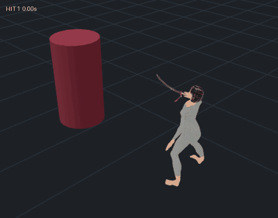

# 플레이어 기본 공격: 야에 사쿠라(붕괴3rd, A 발키리)풍 카타나 5연격

원거리 부적 투척을 근거리 카타나 연격으로 바꿨다. 참고 대상은 붕괴3rd 야에 사쿠라(역신무녀) A급의 한손 카타나 공격이다.

- 팔만 휘두르지 않고 허리·다리·몸 회전을 다 쓰는 전신 동작
- 스텝 베기, 피루엣 회전 베기, 낮은 돌진 베기
- 허리에서 뽑아 두 번 베는 발도 마무리
- 진홍·벚꽃 분홍·자주 불꽃 참격, 잔상, 교차 참격, 큰 데미지 숫자

위 이미지는 Unity 빌더와 같은 계산(구간 자르기, 몸 방향 보정, 루트 이동, 목표 앞 정지)을 three.js로 재현해 렌더한 것이다. 빨간 기둥이 목표이고, 판정 순간에 하얗게 바뀐다.

## 모션: 전신 모션 데이터, 캐릭터 맞춤 제작 없음

모션은 특정 캐릭터 모델에 맞춰 손으로 키를 찍지 않았다. Meshy에서 만든 Humanoid 모션 데이터이며, 순서는 다음과 같다.

1. 표준 체형 마네킹을 Meshy로 만들고 리깅한다.
2. Text to Motion으로 야에 사쿠라풍 동작을 생성해 그 리그에 적용한다.
3. Unity가 FBX를 **Humanoid**로 임포트한다.

따라서 같은 클립이 지금의 Astraia에도, 나중에 바꿀 어떤 Humanoid 모델에도 리타겟된다.

| 타 | 원본 모션 (Text to Motion) | 사용 구간 · 재생 배속 | 길이 / 판정 | 피해 |
| --- | --- | --- | --- | --- |
| 1 | 연속 베기(`Katana_Flurry`): 앞으로 디디며 낮게 오른쪽→왼쪽으로 쓸어 베기 | 0.36–0.86초 · ×1.15 | 0.44초 / 0.28초 | 16 |
| 2 | 같은 모션: 왼쪽 아래에서 올려 베고, 바로 되돌아 벤다 | 0.86–1.68초 · ×1.2 | 0.68초 / 0.22초 + 0.30초 | 12 + 15 |
| 3 | 피루엣(`Katana_Pirouette`): 한 발로 한 바퀴 돌며 칼을 뻗어 벤다 | 1.42–2.05초 · ×1.15 | 0.55초 / 0.37초 | 22 (전방위) |
| 4 | 돌진 베기(`Katana_DashSlash`): 낮게 숙여 파고들며 내려 베고, 낮게 되베기 | 0.28–1.30초 · ×1.45 | 0.70초 / 0.36초 + 0.26초 | 18 + 20 |
| 5 | 발도(`Katana_IaiDraw`): 허리에서 뽑아 수평으로 베고, 크게 대각선으로 벤 뒤 자세 유지 | 0.10–1.70초 · ×1.2 | 1.33초 / 0.50초 + 0.33초 | 28 + 44 |

**팔만 움직이지 않게 한 방법**

- 클립은 원본의 모든 Humanoid 근육 곡선(골반·척추·다리 포함)을 그대로 쓴다.
- 몸 회전(골반이 도는 것)도 포즈에 남긴다.
- 칼을 휘두를 때 몸이 원본대로 크게 돌면 적을 등지게 된다. 그래서 빌더가 루트 회전 곡선에 **방향 보정**을 더한다.
  - 판정 순간 칼끝(측정값 `aimRel`)이 정면을 향하게 한다.
  - 보정은 앞 타의 마지막 몸 방향에서 시작해 준비 동작 동안 부드럽게 들어간다. 그래서 타와 타 사이에 몸이 튀지 않는다.
  - 피루엣은 한 바퀴 회전이 줄지 않도록 보정을 느슨하게 둔다.
  - 마지막 발도는 자세 유지 동안 정면으로 돌아온다.
- 수평 이동은 루트 모션으로 남긴다. `MeleeSlash`가 그 이동으로 캐릭터 컨트롤러를 움직여, 내딛는 걸음과 돌진이 실제로 몸을 옮기고 발이 미끄러지지 않는다.
  - 이동의 75%는 공격 방향으로 꺾는다(`rootMotionSteer`).
  - 목표 앞(`minTargetGap`)에서 멈춘다.
  - 충돌은 `CharacterController`가 처리한다.
- 공격 중에는 `PlayerMotor`의 상체 조준 비틀기가 꺼져 있다(`faceMovementDirection`). 모캡 허리 동작이 덮어쓰이지 않는다.

**측정과 구간**

- 판정 시각과 참격 호의 시작·끝·기울기는 감으로 정하지 않았다. 모션 데이터에서 **칼끝 속도와 궤적**을 측정했다.
- 구간 경계는 칼끝이 느린 프레임에 두었다.
- 칼은 평소 왼쪽 허리에 있다가 공격하면 발도해 오른손에 든다. 1.6초 동안 공격이 없으면 다시 허리로 돌아간다.
- 칼을 쥐는 법과 손가락 감기는 Humanoid 손·손가락 뼈 기준이다.
  - 검지·소지 관절로 손바닥과 엄지 방향을 계산해, 칼이 엄지 쪽으로 나온다.
  - 모델이 바뀌어도 그대로 동작한다.

빌드 방법:

- `AstraiaAnimationBuilder`가 FBX에서 구간을 잘라 방향을 보정하고 `Astraia_Katana_01~05`를 60fps로 굽는다.
- 프로젝트를 열거나 `Katana/*.fbx` 임포트가 끝나면 자동으로 한 번 실행된다(`Astraia_Katana_05`가 없을 때). 예전 4연격 클립만 있는 프로젝트도 이때 새로 굽는다.
- 다시 굽고 싶으면 **AC Roguelike → Astraia → Rebuild Katana Motions**를 실행한다.
- FBX를 못 찾으면(예: `git lfs pull` 전) 예비용 절차 모션을 쓴다.

**캐릭터를 바꿀 때:**

1. 새 모델을 Humanoid로 임포트하고 `AstraiaPlayer`의 Animator 아바타만 바꾼다.
2. 컨트롤러와 클립, 칼 장착은 그대로 쓴다.
3. 칼 위치가 어긋나면 `MeleeSlash.katanaLength`와 `gripCurl`만 조정한다.

## 조작

- 좌클릭 또는 J. 누르고 있으면 5연격이 이어진다.
- 대시로 언제든 끊는다.
- 6m 안의 적에게는 판정 직전까지 파고든다.

## 타격감

| 상황 | 연출 |
| --- | --- |
| 휘두를 때 | 칼끝 궤적은 **칼끝이 실제로 빠르게 움직이는 순간에만** 나온다(초속 12m에서 켜지고 7m 아래로 꺼짐, 0.09초 잔광). 초승달 참격 2겹(진홍 → 벚꽃)이 측정한 궤적 방향으로 그려진다. |
| 돌진·발도 | 몸의 잔상(분홍, 발도는 자주)이 0.035초마다 남고, 시작할 때 발밑에 먼지가 인다. |
| 적중 | 노란 불꽃 파편, 벚꽃잎, 분홍 고리, 적이 순간 하얗게 번쩍, 데미지 숫자. 적 위로 화면 기울기에 맞춘 가는 참격선이 한 줄 그어진다. |
| 마무리(5타) | 두꺼운 자주 참격, 바닥 원형 참격, 벚꽃잎 폭풍, 적 위 X자 교차 참격, 분홍 화면 섬광. 두 번째 베기는 적을 더 멀리 날린다. |
| 시간과 화면 | 히트 스톱(일반 약 0.05초, 마무리 약 0.11초)과 카메라 흔들림 |
| 살아남은 적 | 공격 반대쪽으로 밀려나고 움찔한다. 공격 준비 중이면 공격이 조금 늦어진다. |
| 사망 | 공격 방향으로 날아간 뒤 등으로 넘어져 착지한다. 한 번 튀며 먼지가 일고, 누운 채 잠시 있다가 바닥으로 가라앉아 사라진다. |

보스는 경직과 밀림이 작다. 일시정지나 증강 선택 중에는 히트 스톱이 시간을 건드리지 않는다.

## Meshy 사용

| 항목 | credits |
| --- | --- |
| 카타나 모델 (벚꽃 코등이, 떠 있는 손잡이 조각 제거) | 30 |
| 리깅용 마네킹 생성 + 리깅 | 35 |
| Text to Motion 1차 4종 (발도 베기, 빠른 연속 베기, 회전 베기, 대기 자세) | 40 |
| Text to Motion 2차 6종 (돌진 베기, 피루엣, 공중 회전 베기, 띄우기 베기, 연속 베기, 돌진 발도) | 60 |
| 리그에 모션 적용 (Text to Motion 10종 + 라이브러리 검 공격 5종) | 45 |

도구: `Tools/PlayerMelee/meshy_katana.py`, `clean_katana.py`, `meshy_motion.py`. 키는 `MESHY_API_KEY` 환경 변수로만 읽는다. 원본과 작업 ID는 git에서 제외된 `Tools/PlayerMelee/Source/`에 있다. 쓰지 않은 후보(공중 회전 베기, 띄우기 베기, 돌진 발도, 라이브러리 검 공격)도 같은 리그에 적용해 두었다. 바꾸고 싶으면 FBX를 `Animations/Katana`에 넣고 `KatanaSegments`에 추가하면 된다. 공중 회전 베기와 띄우기 베기는 몸이 0.6~2m 떠서 쿼터뷰 전투에서는 뺐다.

## 코드

| 파일 | 내용 |
| --- | --- |
| `Assets/Gameplay/Scripts/MeleeSlash.cs` | 5연격 데이터, 칼 장착·발도·손가락 감기, 루트 모션 이동(`MeleeRootMotion`), 돌진, 부채꼴 판정, 2연타, 칼끝 속도 궤적, 잔상, 피해·피격 방향, 연출 호출 |
| `Assets/Gameplay/Scripts/HitFeedback.cs` | 히트 스톱, 카메라 흔들림, 참격·참격선·교차 참격·화면 섬광·잔상·불꽃·벚꽃·고리·번쩍임·데미지 숫자·먼지 |
| `Assets/Characters/Astraia/Editor/AstraiaAnimationBuilder.cs` | FBX 모션 구간 → 방향 보정 → Attack1~5 클립과 상태, 자동 재빌드 |
| `Assets/Characters/Astraia/Animations/Katana/*.fbx` | Humanoid 모션 원본 (Git LFS) |
| `PlayerCombat.cs` | 5단 콤보(Attack5 상태), 근접 호출, 복귀 블렌드(`returnBlend`). 입력·콤보 버퍼·대시 취소는 그대로다. |
| `TalismanCaster.cs` | 근접 적중을 시전 1회로 센다. 기존 검증과 지원 스킬이 그대로 동작한다. |
| `TrainingEnemy.cs`, `LiminalEnemy.cs` | 피격 이벤트·방향·세기, 넉백, 경직, 사망 비행·착지·소멸 |
| `IsometricFollowCamera.cs` | 카메라 흔들림 |

## 확인한 것과 남은 것

Unity 에디터 없이 작업했다. 확인한 것은 다음과 같다.

- C# 컴파일: Unity 6000.3.19f1 참조 어셈블리로 통과
- 모션: 빌더와 같은 보정·이동 계산을 웹 렌더로 재현해 확인(위 이미지)
- 판정 시각과 참격 호: 모션 데이터에서 측정

Unity에서 처음 열었을 때 확인할 것:

1. `Katana/*.fbx`가 Humanoid 아바타로 자동 설정되는지(Inspector → Rig에 체크 표시). Meshy 리그는 A 포즈라, 팔 각도가 어긋나 보이면 Rig → Configure → Pose → **Enforce T-Pose**를 한 번 적용하고 Rebuild Katana Motions를 다시 실행한다.
2. 칼을 쥔 각도와 손가락 모양. `MeleeSlash`의 `gripCurl`과 `LateUpdate`의 손잡이 방향 비율로 조정한다.
3. 판정 순간 몸이 적을 향하는지. 어긋나면 `KatanaSegments`의 `aimRel`(도)을 고치고 Rebuild Katana Motions를 실행한다.
4. 걸음 이동량. `MeleeSlash.rootMotionScale`, `rootMotionSteer`, `minTargetGap`으로 조정한다.
5. 이펙트 밝기와 히트 스톱 길이. `MeleeSlash.swings`, `trailOnSpeed`/`trailOffSpeed`에서 조정한다.
