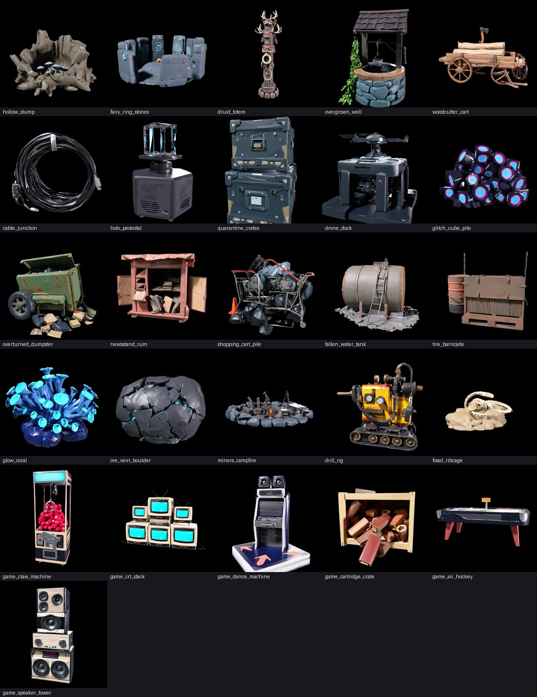
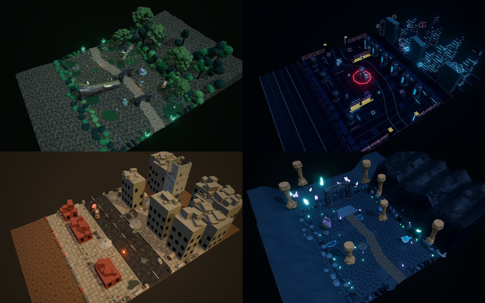

# Theme decor batch (2026-10)

26 new Meshy dressing props so neighbouring rooms in a shuffled route stop showing the same set dressing.

| Theme | Props |
|---|---|
| Forest (달빛 고목의 숲) | hollow_stump, fairy_ring_stones, druid_totem, overgrown_well, woodcutter_cart |
| Digital (프로그램 감옥) | cable_junction, holo_pedestal, quarantine_crates, drone_dock, glitch_cube_pile |
| Ruins (멸망한 지구) | overturned_dumpster, newsstand_ruin, shopping_cart_pile, fallen_water_tank, tire_barricade |
| Cave (심연의 수정 동굴) | glow_coral, ore_vein_boulder, miners_campfire, drill_rig, fossil_ribcage |
| Game (게임의 잔상) | game_claw_machine, game_crt_stack, game_dance_machine, game_cartridge_crate, game_air_hockey, game_speaker_tower |

## Generation
- Forest/Digital/Ruins/Cave: `Tools/StageConcepts/meshy_variations.py` (meshy-7.1, ~15k triangles, 2K PBR).
- Game: `Tools/GameTheme/meshy_assets.py` (6k-10k triangles), then `Tools/GameTheme/optimize_textures.py` (1K maps).
- Review: `toppled_streetlight` failed twice (thin pole, loose fragments) and was replaced by `overturned_dumpster`;
  `fossil_ribcage` was regenerated once (first try was a small skull sculpture); `game_claw_machine` was retextured
  once (lettering on the marquee). About 750 credits including the retries.

## Placement
- **StageConcepts rooms**: `Tools/StageConcepts/variations/decor.py`, run by `build.py` after each room recipe. Each room
  gets three of its theme's five props, rotated per room index. A seeded search keeps every prop off keep-clear paths,
  existing Meshy footprints, authored boxes (water, ramps, bridges), the player spawn and enemy spawns; props over 2.5 m
  only go on the east backdrop side or the far end (VariationPlan camera rule). After each placement the flood fill must
  still reach both doors and every enemy, and lose no more floor than the prop's own footprint.
  Result: 83 props over 28 rooms (Cave_04 has two), traversal port 28/28, every room under the 450k triangle budget.
- **Game rooms**: hand-placed `Decor(...)` calls in `Assets/GameTheme/Editor/GameThemeBuilder.cs`; rebuild with the
  Game theme builder menu and run `GameThemeValidation` in Unity (not run here: needs the editor).

